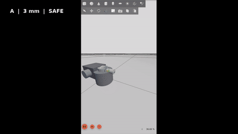

# Uncertainty-Aware Surgical Navigation with Active Perception and Autonomous Safety

A simulation-based medical-robotics research framework that connects **perception uncertainty, active perception, collision/risk-aware motion planning, ROS 2 execution, and autonomous safety supervision**.

> **Research prototype:** This repository is for simulation and engineering research only. It is not a clinical system, medical device, or validated surgical platform.

## Project Context

I started this as a **self-directed summer project immediately after completing my first year of Biomedical Engineering**. It began with a simple collision-aware planning problem and developed incrementally as I researched the limitations of each stage and learned the mathematics, algorithms, experimental methods, and robotics tools needed to address them.

For the full development story — including what I knew at the start, how I found the relevant methods and platforms, how the mathematics was learned and applied, what failed, and how established technologies were distinguished from my own project contribution — see **[Project Development Journey](docs/project_development.md)**.

## Start Here — Documentation Map

| Area | Document |
|---|---|
| **How the project developed** | [Project Development Journey](docs/project_development.md) |
| **System architecture** | [Architecture](docs/architecture.md) |
| **Coordinate conventions** | [Coordinate Frames](docs/coordinate_frames.md) |
| **Research methodology** | [Experimental Protocol](docs/experimental_protocol.md) |
| **Engineering requirements** | [Requirements](docs/requirements.md) |
| **Verification strategy** | [Verification Plan](docs/verification_plan.md) |
| **Requirement-to-evidence mapping** | [Traceability Matrix](docs/traceability_matrix.md) |
| **Final ROS 2 runtime evidence** | [ROS 2 Runtime Evidence](docs/final_ros2_runtime_evidence.md) |
| **Experimental-results index** | [Results Guide](results/README.md) |
| **Final research evidence** | [Final Results Report](results/final_evidence/final_results_report.md) |

## Demo

[](docs/media/surgical_navigation_github_demo_final.mp4)

The final ROS 2/Gazebo demonstration holds the **robot, target, planner, and execution stack constant** while changing localisation uncertainty. The runtime responds autonomously by continuing, requesting reacquisition, or stopping.

| Case | Localisation uncertainty | Runtime response | Outcome |
|---|---:|---|---|
| **A** | **3 mm** | `SAFE → EXECUTE` | Completed |
| **B** | **20 mm** | `REACQUIRE` | Safe abort after persistent uncertainty |
| **C** | **35 mm** | `STOP` | Autonomous safety stop |

The demo uses simulated perception and is not clinical validation.

## The Problem

A motion planner can appear safe if it is allowed to use perfect simulator geometry. A real navigation system instead acts on **estimates** of anatomy, and those estimates may be uncertain.

This project asks:

> **How should a simulated surgical-navigation system change its perception, planning, and runtime behaviour when confidence in anatomical localisation changes?**

A central design rule is therefore **truth isolation**: hidden simulator geometry may generate observations and independently evaluate outcomes, but deployable planning and safety logic must reason from estimated anatomy and uncertainty.

## What I Built

The strongest components of the project are:

- **Truth-separated surgical simulation** in which planning is based on estimated anatomy rather than privileged simulator geometry.
- **Collision-aware joint-space RRT planning**, including edge validation, path shortcutting, trajectory generation, and uncertainty-inflated safety reasoning.
- **Generic and Task-Aware Active Perception**, with viewpoint feasibility, visibility/occlusion reasoning, and task-relevant scoring.
- **Controlled experimental evaluation**, including deterministic seeds, movement-budget matching, frozen protocols, held-out scenarios, ablations, robustness tests, bootstrap confidence intervals, and permutation testing.
- **Perception and uncertainty experiments** covering stereo uncertainty, learned segmentation, registration/tracking, calibration, and illumination degradation.
- **Closed-loop runtime safety**, using uncertainty, predicted clearance, tracking error, recovery/replanning, reacquisition, and autonomous stopping.
- **ROS 2/Gazebo integration**, including custom interfaces, a navigation action, ros2_control execution, runtime nodes, and reproducible A/B/C safety demonstrations.

Established methods such as RRT, U-Net-style segmentation, ROS 2, Gazebo, ros2_control, bootstrap statistics, and active-perception concepts are **not claimed as original inventions**. The contribution of this project is in how these methods were learned, implemented, integrated, experimentally challenged, and validated within the uncertainty-aware navigation framework.

## Project Evolution

The project was not designed in its final form at the beginning. Each stage emerged from a limitation in the previous one:

```text
Collision-free path planning
        ↓
Protected-anatomy avoidance
        ↓
Estimated anatomy + uncertainty
        ↓
Active perception
        ↓
Task-aware viewpoint selection
        ↓
Fair repeated and held-out evaluation
        ↓
Risk/uncertainty-aware planning
        ↓
Closed-loop execution
        ↓
Autonomous runtime safety
        ↓
ROS 2 + Gazebo integration
```

That progression, including the problems and failed assumptions that changed the design, is documented in [docs/project_development.md](docs/project_development.md).

## System Architecture

```text
SIMULATED WORLD / HIDDEN TRUTH
              |
              +----> observation generation
              |
              +----> independent evaluation

ESTIMATED ANATOMY + UNCERTAINTY
              |
              v
       ACTIVE PERCEPTION
   Generic / Task-Aware scoring
              |
              v
     UPDATED STATE ESTIMATE
              |
              v
 UNCERTAINTY-AWARE PLANNING
      collision-aware RRT
              |
              v
          EXECUTION
              |
              v
      RUNTIME MONITORING
 clearance / tracking / uncertainty
              |
              v
    AUTONOMOUS SUPERVISOR
 continue / reacquire / recover
          replan / stop
              |
              v
      ROS 2 + ros2_control
              |
              v
       GAZEBO SIMULATION
```

The research-core algorithms remain separated from the ROS integration layer. See [docs/architecture.md](docs/architecture.md) for the detailed architecture.

## Key Experimental Result

The primary held-out comparison asked whether **Full Task-Aware Active Perception** improved safe navigation relative to a **movement-budget-matched Generic Active** strategy.

It did **not** establish Task-Aware superiority.

| Metric | Full Task-Aware | Budget-Matched Generic |
|---|---:|---:|
| Safe-navigation success | **61.33%** | **71.33%** |
| Difference | **−10.00 percentage points** | |
| 95% bootstrap CI | **[−17.00, −3.00] pp** | |
| Two-sided permutation p-value | **0.012390** | |

The negative result was retained without post-hoc retuning. The held-out movement budgets also remained imperfectly matched (93.544 mm vs 122.548 mm; 31.01% mismatch), so the observed difference cannot be cleanly attributed to task awareness alone.

Rather than treating this as a failed project, I used the result to motivate mechanism ablations, uncertainty stress tests, robustness analysis, and closer examination of experimental fairness.

See [Experimental Protocol](docs/experimental_protocol.md) and [Final Results Report](results/final_evidence/final_results_report.md).

## ROS 2 Autonomous Safety Demonstration

The final runtime integrates:

**simulated perception → planning → trajectory execution → runtime monitoring → autonomous supervision**

using ROS 2 Jazzy, Gazebo Harmonic, ros2_control, and project-specific ROS interfaces.

The navigation action reports progress, current pose, safety state, terminal state, and success/failure. Runtime monitoring can trigger:

```text
CONTINUE → REACQUIRE → RECOVER / REPLAN → STOP
```

In the A/B/C demonstration, the same target and navigation stack are used while uncertainty changes from 3 mm to 20 mm to 35 mm. Case A completes, Case B enters reacquisition and safely aborts when uncertainty persists, and Case C is stopped by the autonomous supervisor.

Full evidence: [docs/final_ros2_runtime_evidence.md](docs/final_ros2_runtime_evidence.md).

## Technical Stack

| Area | Technologies |
|---|---|
| Research / algorithms | Python, NumPy, PyBullet |
| Perception experiments | OpenCV, PyTorch |
| Robotics runtime | ROS 2 Jazzy |
| Simulation | Gazebo Harmonic |
| Control integration | ros2_control |
| Verification | pytest, colcon test |
| Development environment | Ubuntu / WSL, Conda |

## Verification & Reproducibility

The final validated research-core regression produced:

**1031 passed**

The final ROS 2 workspace validation produced:

**29 tests, 0 errors, 0 failures, 2 skipped**

The repository also includes deterministic seeds, machine-readable results, frozen experimental protocols, held-out scenarios, requirements, verification planning, traceability, and a reproducibility manifest.

These tests demonstrate software verification and regression coverage. They do **not** constitute clinical validation or prove medical-device safety.

## How to Run

### Python research framework

```bash
git clone https://github.com/Joshitha293/uncertainty-aware-surgical-navigation.git
cd uncertainty-aware-surgical-navigation
pytest
```

The repository includes `environment.yml` for the research environment.

### ROS 2 runtime

The validated runtime uses **Ubuntu/WSL + ROS 2 Jazzy + Gazebo Harmonic**. The ROS packages are located under `ros2/src/`:

```text
surgical_navigation_interfaces
surgical_navigation_ros
surgical_navigation_description
surgical_navigation_bringup
```

After building these packages in a ROS 2 workspace and sourcing the workspace, launch a demonstration with:

```bash
ros2 launch surgical_navigation_bringup surgical_navigation.launch.py demo_case:=A
```

Use `demo_case:=B` or `demo_case:=C` for the higher-uncertainty safety cases.

Detailed runtime behaviour and evidence are documented in [docs/final_ros2_runtime_evidence.md](docs/final_ros2_runtime_evidence.md).

## Repository Structure

```text
.
├── src/
│   ├── geometry/       # geometry, transforms and registration foundations
│   ├── perception/     # perception, uncertainty and active perception
│   ├── robotics/       # planning, execution and safety algorithms
│   └── simulation/     # experiments, benchmarks and evidence generation
├── ros2/src/           # four ROS 2 packages
├── tests/              # research-core automated tests
├── results/            # experiment outputs and final evidence
└── docs/               # architecture, methodology and verification documents
```

## Limitations & Scope

This is a **simulation-based robotics research prototype**. It currently has:

- no physical surgical robot or hardware-in-the-loop validation;
- no cadaveric, animal, or human testing;
- no clinical validation or medical-device certification;
- simulated runtime perception in the final ROS 2 demonstration;
- simplified anatomy, instrument, tissue, and collision models;
- no tissue deformation or force interaction;
- no guarantee that simulation performance transfers to clinical environments;
- experimental safety thresholds that are not clinically validated limits.

The project should therefore be interpreted as evidence of robotics research, systems integration, experimental design, and autonomous-safety engineering — **not clinical readiness**.

## Documentation

The README is intentionally a project-level overview. Detailed reasoning and evidence are maintained separately:

- **Development and learning:** [docs/project_development.md](docs/project_development.md)
- **Architecture:** [docs/architecture.md](docs/architecture.md)
- **Coordinate frames:** [docs/coordinate_frames.md](docs/coordinate_frames.md)
- **Experimental methodology:** [docs/experimental_protocol.md](docs/experimental_protocol.md)
- **Requirements:** [docs/requirements.md](docs/requirements.md)
- **Verification:** [docs/verification_plan.md](docs/verification_plan.md)
- **Traceability:** [docs/traceability_matrix.md](docs/traceability_matrix.md)
- **ROS 2 runtime evidence:** [docs/final_ros2_runtime_evidence.md](docs/final_ros2_runtime_evidence.md)
- **Results index:** [results/README.md](results/README.md)
- **Final results:** [results/final_evidence/final_results_report.md](results/final_evidence/final_results_report.md)

## License

See [LICENSE](LICENSE).
