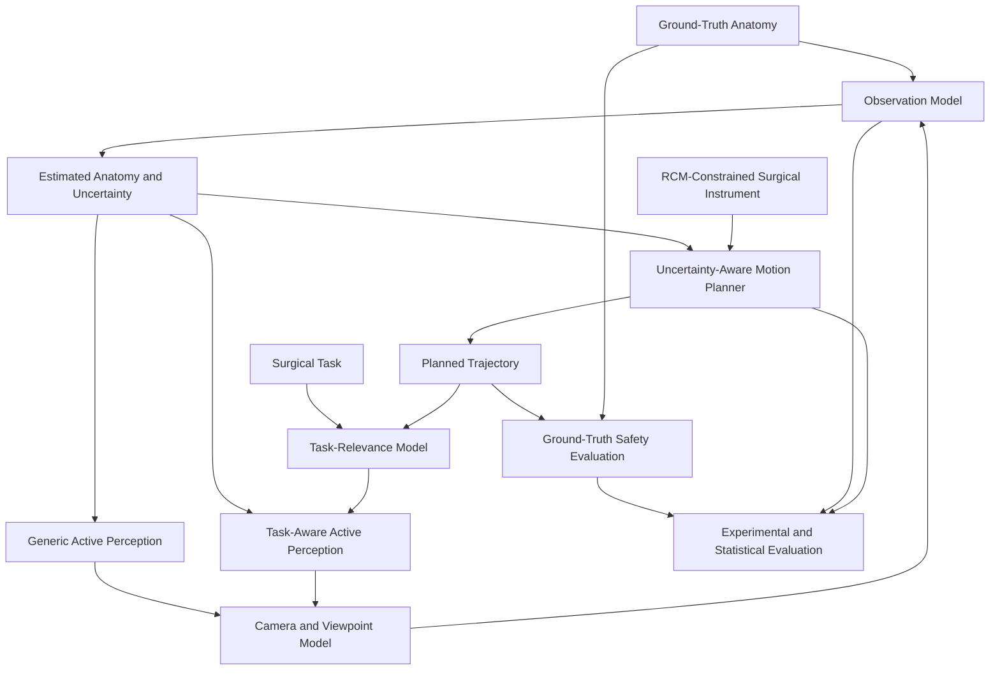

# System Architecture

## 1. Purpose

This document describes the software and research architecture of the uncertainty-aware surgical navigation framework.

The system is designed to investigate the interaction between:

* minimally invasive surgical robot kinematics;
* safety-critical motion planning;
* imperfect anatomical perception;
* explicit localisation uncertainty;
* active camera viewpoint selection;
* task-aware perception;
* ground-truth safety evaluation.

The architecture deliberately separates planning, perception, task information, simulation ground truth, and experimental evaluation so that each component can be tested independently and combined in controlled experiments.

The framework is a simulation research prototype and is not intended for clinical use.

---

## 2. Architectural Objectives

The architecture was designed around six principal objectives.

### 2.1 Safety separation

Safety evaluation must not depend solely on the same imperfect anatomical estimate supplied to the planner.

The framework therefore maintains a distinction between:

1. perceived anatomical state used for decision-making; and
2. hidden ground-truth anatomical state used for evaluation.

This permits trajectories that appear safe under imperfect perception to be evaluated against the true simulated environment.

### 2.2 Explicit uncertainty

Perception uncertainty is represented explicitly rather than being hidden inside a heuristic.

The planning and perception layers can therefore reason about localisation uncertainty as a measurable state variable.

### 2.3 Modular perception and planning

Camera modelling, observation quality, task relevance, active perception, motion planning, and safety evaluation are implemented as separable components.

This supports:

* independent unit testing;
* controlled ablation;
* replacement of individual algorithms;
* reproducible benchmarking.

### 2.4 Task-aware information use

Task-aware perception should not simply maximise global visual quality.

The task-aware layer receives information about the intended surgical trajectory and safety-critical regions, allowing viewpoint selection to prioritise information relevant to the current navigation task.

### 2.5 Reproducible experimentation

Stochastic operations use controlled random-number generators and seeds where appropriate.

Experimental strategies can therefore be compared under matched conditions.

### 2.6 Verification before integration

Individual geometry, robotics, planning, perception, uncertainty, and experimental components are verified independently before being incorporated into higher-level pipelines.

---

## 3. System Context

The framework models a simplified minimally invasive surgical navigation problem.

A surgical instrument must move through a constrained workspace while avoiding safety-critical anatomical structures.

The robot does not necessarily know the true locations of these structures.

Instead, simulated perception produces an estimated anatomical state and associated uncertainty.

Active perception may then select a new camera viewpoint to improve the observation.

Task-aware active perception additionally considers where uncertainty matters relative to the intended surgical trajectory.

The resulting anatomical estimate can be used by the uncertainty-aware motion planner.

Ground-truth geometry remains hidden from the decision-making algorithms and is used only for final safety evaluation.

---

## 4. High-Level Architecture



The architecture contains feedback between perception and planning, but ground truth remains outside the decision loop.

---

## 5. Software Layers

The core Python framework is divided into four principal packages:

```text
src/
├── geometry/
├── robotics/
├── perception/
└── simulation/
```

Each layer has a distinct responsibility.

---

## 6. Geometry Layer

### Location

```text
src/geometry/
```

### Responsibilities

The geometry layer defines mathematical representations used throughout the framework.

It contains functionality for:

* coordinate transformations;
* workspace geometry;
* geometric structures;
* spatial relationships.

The geometry layer should remain independent of high-level planning or perception policy.

This prevents motion-planning decisions from becoming embedded inside low-level mathematical utilities.

### Principal design role

```text
Geometry
    ↓
common spatial representation
    ↓
Robotics + Perception + Simulation
```

---

## 7. Robotics Layer

### Location

```text
src/robotics/
```

### Principal modules

```text
instrument.py
planner.py
safety.py
trajectory.py
```

### 7.1 Instrument model

The surgical instrument model represents the kinematic configuration of the minimally invasive instrument.

The implemented configuration contains four joint variables and maintains the remote-centre-of-motion constraint.

The model provides geometric information required by the planner, including the instrument shaft segment and tip location.

### 7.2 Safety evaluation

The safety subsystem evaluates the instrument relative to safety-critical anatomical structures.

Safety is treated separately from planner search logic.

Conceptually:

```text
Robot configuration
        ↓
Instrument geometry
        ↓
Safety evaluator
        ↓
collision?
safety-margin violation?
clearance?
```

This separation means the same safety model can be reused by:

* configuration validation;
* edge validation;
* trajectory evaluation;
* experimental benchmarking.

### 7.3 Motion planner

The planner performs collision-aware joint-space search.

A planning result contains:

```text
path
success
iterations
```

Candidate configurations and edges are evaluated against the safety subsystem.

The planner therefore does not define anatomical collision logic itself.

Instead:

```text
Planner
   ↓ asks
Safety subsystem
   ↓ returns
safe / unsafe
```

### 7.4 Trajectory processing

Trajectory utilities are separated from the initial sampling-based planning process.

This enables path generation and subsequent optimisation/processing to be evaluated independently.

---

## 8. Perception Layer

### Location

```text
src/perception/
```

### Principal modules

```text
camera.py
viewpoints.py
observation.py
occlusion.py
uncertainty.py
perception.py
planning.py
viewpoint_scoring.py
active_perception.py
closed_loop.py
task_relevance.py
task_aware_scoring.py
task_aware_active_perception.py
```

This is intentionally decomposed because camera geometry, observation modelling, uncertainty, task relevance, and policy selection represent different concerns.

---

## 9. Camera and Viewpoint Representation

The camera subsystem describes the pose from which anatomical structures are observed.

Candidate viewpoints are represented independently from the viewpoint-selection algorithm.

The separation is:

```text
Candidate generation
        ↓
Candidate viewpoints
        ↓
Scoring strategy
        ↓
Selected viewpoint
```

This allows exactly the same candidate set to be evaluated using different perception strategies.

That is important for fair experimental comparison.

---

## 10. Observation Model

The observation model converts:

```text
camera pose
+
target anatomy
+
possible occluders
```

into a simulated observation and observation-quality estimate.

The observation model represents viewpoint-dependent localisation performance.

This creates the causal connection:

```text
Viewpoint
    ↓
Observation geometry
    ↓
Observation quality
    ↓
Localisation uncertainty
```

rather than assigning arbitrary performance directly to an active-perception algorithm.

---

## 11. Occlusion Model

Occlusion is modelled independently from the active-perception controller.

The observation model can therefore evaluate whether a viewpoint has degraded visibility without requiring the viewpoint selector to contain explicit occlusion geometry.

This preserves a clean boundary:

```text
Environment geometry
        ↓
Occlusion / observation model
        ↓
Quality estimate
        ↓
Viewpoint scorer
```

---

## 12. Generic Active Perception

Generic active perception selects a candidate viewpoint according to perception utility without receiving task trajectory information.

Its role is intentionally restricted.

Inputs include:

* current camera pose;
* candidate viewpoints;
* target structure;
* possible occluders.

The generic controller does not receive:

* the planned surgical trajectory;
* task-specific safety relevance.

This makes it a suitable comparison strategy for task-aware perception.

---

## 13. Generic Closed Loop

The generic closed-loop controller implements a complete select-and-observe perception cycle.

```text
Current camera pose
        ↓
Evaluate candidates
        ↓
Select viewpoint
        ↓
Move simulated camera
        ↓
Acquire simulated observation
        ↓
Measure post-observation quality
        ↓
Return localisation result
```

The closed-loop controller remains deliberately task-agnostic.

This architectural distinction is essential for the planned comparison between generic and task-aware perception.

---

## 14. Surgical Task Representation

Task-aware perception uses an explicit representation of the surgical task.

A surgical task contains:

```text
trajectory:             N × 3 points
safety-critical points: M × 3 points
```

The trajectory identifies where the instrument is expected to travel.

Safety-critical points identify locations where accurate perception may be particularly important.

Task information is therefore represented separately from camera information.

---

## 15. Task-Relevance Model

Task relevance is calculated according to the spatial relationship between safety-critical locations and the planned trajectory.

Conceptually:

[
R(x) =
\exp\left(
-\frac{1}{2}
\left(
\frac{d(x,\mathcal{T})}
{\sigma_R}
\right)^2
\right)
]

where:

* (x) is a safety-critical location;
* (\mathcal{T}) is the planned trajectory;
* (d(x,\mathcal{T})) is minimum distance from the location to the trajectory;
* (\sigma_R) controls the spatial relevance scale.

Locations closer to the intended trajectory therefore receive greater task relevance.

This gives task awareness an explicit geometric basis.

---

## 16. Task-Aware Active Perception

Task-aware active perception extends generic viewpoint evaluation by incorporating information about the surgical task.

The controller therefore considers:

```text
Perception quality
        +
Uncertainty
        +
Task relevance
        +
Task alignment
        +
Camera movement cost
```

rather than optimising perception quality alone.

Conceptually:

```text
Candidate viewpoint
        ↓
Generic observation utility
        +
Trajectory-dependent relevance
        +
Task-specific information
        ↓
Task-aware utility
        ↓
Selected viewpoint
```

Generic and task-aware perception remain separate policies so that their behaviour can be directly compared.

---

## 17. Uncertainty Representation

Perception uncertainty is treated as an explicit output of the observation/perception subsystem.

For isotropic positional uncertainty:

[
\Sigma = \sigma^2 I
]

The planning layer can use uncertainty to increase the protected region around perceived anatomy.

A simplified uncertainty-aware safety margin is:

[
m_{\text{plan}}
===============

m_{\text{base}}
+
k\sigma
]

where:

* (m_{\text{base}}) is the nominal safety margin;
* (\sigma) represents localisation uncertainty;
* (k) controls conservatism.

The architecture therefore connects perception quality to planning behaviour through an explicit uncertainty variable.

---

## 18. Ground-Truth Isolation

Ground-truth anatomy is deliberately isolated from the planner.

### Decision path

```text
Ground truth
      ↓
Simulated perception
      ↓
Estimated anatomy
      ↓
Planner
```

### Evaluation path

```text
Ground truth
      ↓
Safety evaluator
      ↑
Planned trajectory
```

The planner must not access the evaluation ground truth.

This prevents information leakage and preserves the validity of uncertainty experiments.

---

## 19. Experimental Layer

### Location

```text
src/simulation/
```

The simulation layer contains controlled experimental drivers rather than core robot/perception logic.

Current experiment classes include:

* deterministic and uncertainty-aware benchmarks;
* active-perception benchmarks;
* task-aware benchmarks;
* safety-critical benchmarks;
* Monte Carlo experiments;
* uncertainty sweeps;
* ablation experiments;
* task-weight sensitivity;
* uncertainty sensitivity;
* uncertainty-heterogeneity sensitivity;
* statistical validation;
* figure generation.

This separation allows algorithms to remain reusable while experiments define:

```text
scenario
+
parameters
+
random seeds
+
strategies
+
metrics
```

---

## 20. Experimental Strategy Architecture

The final research comparison is designed around three perception policies.

### Strategy A — Fixed View

```text
Fixed camera
    ↓
Observation
    ↓
Estimated anatomy + uncertainty
    ↓
Planner
```

### Strategy B — Generic Active Perception

```text
Candidate viewpoints
    ↓
Generic perception utility
    ↓
Selected viewpoint
    ↓
Observation
    ↓
Estimated anatomy + uncertainty
    ↓
Planner
```

### Strategy C — Task-Aware Active Perception

```text
Planned task / trajectory
        +
Candidate viewpoints
        ↓
Task-aware utility
        ↓
Selected viewpoint
        ↓
Observation
        ↓
Estimated anatomy + uncertainty
        ↓
Planner
```

All strategies should ultimately be evaluated through the same ground-truth safety pipeline.

---

## 21. Common Evaluation Outputs

The final end-to-end comparison should use common outputs so that one strategy is not favoured through different evaluation criteria.

### Perception metrics

* localisation error;
* predicted uncertainty;
* viewpoint movement;
* occlusion/visibility quality.

### Planning metrics

* planning success;
* iterations;
* planning time;
* path cost.

### Safety metrics

* physical collision;
* safety-margin violation;
* minimum true clearance.

### Statistical outputs

* mean and median;
* variability;
* confidence intervals;
* paired differences;
* effect sizes where appropriate.

---

## 22. Verification Architecture

Verification is organised at multiple levels.

### Level 1 — Mathematical and geometry tests

Examples:

* coordinate transformations;
* workspace geometry;
* distance calculations.

### Level 2 — Component tests

Examples:

* surgical instrument;
* collision/safety evaluation;
* uncertainty representation;
* camera model;
* observation model.

### Level 3 — Algorithm tests

Examples:

* planner behaviour;
* viewpoint scoring;
* active perception;
* task-aware selection.

### Level 4 — Integration tests

Examples:

* closed-loop active perception;
* safety-critical planning;
* experimental benchmark behaviour.

### Level 5 — Statistical/experimental validation

Examples:

* matched experimental results;
* sensitivity analysis;
* statistical benchmark utilities.

The core framework currently has a verified regression baseline of:

```text
377 passed
0 failed
```

in a fresh documented Conda environment.

---

## 23. Reproducibility Architecture

The core Python environment is defined in:

```text
environment.yml
```

The regression-test discovery configuration is defined in:

```text
pytest.ini
```

Continuous integration is defined under:

```text
.github/workflows/
```

The intended reproducibility chain is:

```text
Repository
    ↓
environment.yml
    ↓
Fresh Python 3.11 environment
    ↓
Core test suite
    ↓
Reproducible regression baseline
```

---

## 24. ROS 2 Boundary

ROS 2 integration is treated as a separate system-integration layer rather than a dependency of the core research algorithms.

Conceptually:

```text
Core research algorithms
        ↓
ROS-facing adapters / nodes
        ↓
ROS 2 communication
        ↓
Planning / perception / safety messages
```

This separation has two advantages:

1. the research framework remains runnable without ROS 2;
2. the algorithms can still demonstrate robotics middleware integration.

ROS 2-specific validation therefore belongs to the ROS 2 environment rather than the standard Python regression suite.

---

## 25. Current and Target Closed Loops

### Current generic perception loop

Implemented:

```text
Viewpoint candidates
        ↓
Generic selection
        ↓
Observation
        ↓
Updated observation quality
```

### Current task-aware selection

Implemented:

```text
Task trajectory
        +
Viewpoint candidates
        ↓
Task-aware selection
```

### Target end-to-end navigation loop

The remaining integration objective is:

```text
Initial anatomical estimate
        ↓
Initial trajectory / task
        ↓
Task relevance
        ↓
Viewpoint selection
        ↓
New observation
        ↓
Updated uncertainty
        ↓
Uncertainty-aware replanning
        ↓
Ground-truth safety evaluation
```

This remaining connection is intentionally documented as unfinished rather than represented as an already completed capability.

---

## 26. Safety Boundaries

Several architectural boundaries exist specifically to preserve safety-related reasoning.

### Boundary 1 — Ground truth vs estimate

Ground truth must not be used by the planner.

### Boundary 2 — Perception vs safety

Improved perception quality does not automatically imply improved navigation safety.

The final system must measure navigation outcomes directly.

### Boundary 3 — Planner success vs physical safety

A planner returning a valid path according to perceived anatomy does not prove that the path is safe relative to hidden ground truth.

### Boundary 4 — Simulation vs clinical validity

Simulation results demonstrate behaviour within the implemented model only.

They do not establish clinical effectiveness.

---

## 27. Design Trade-Offs

The architecture intentionally exposes several competing objectives.

### Planning conservatism

Greater uncertainty inflation may increase safety but reduce planning feasibility or increase path cost.

### Active perception

A better observation may require greater camera movement.

### Task-aware perception

Task relevance may improve information where it matters while potentially sacrificing globally optimal perception quality.

### Computational cost

Higher-fidelity safety checks, larger RRT searches, or additional viewpoint evaluation may increase computation.

The framework therefore evaluates multiple metrics rather than treating any single metric as sufficient.

---

## 28. Assumptions

The current architecture assumes:

* simplified rigid anatomical geometry;
* simplified surgical-instrument geometry;
* simulated camera observations;
* Gaussian localisation uncertainty;
* static safety-critical anatomy within individual planning experiments;
* no deformable-tissue mechanics;
* no physical force interaction;
* no clinical sensor data.

These assumptions define the scope of conclusions that can be drawn from the simulation.

---

## 29. Non-Goals

The project is not currently intended to implement:

* clinical surgical guidance;
* autonomous surgery;
* medical diagnosis;
* regulatory-grade medical-device software;
* full deformable-tissue simulation;
* learned medical-image segmentation;
* complete visual SLAM;
* real-time hardware control.

These features are outside the research question and are deliberately excluded to prevent unnecessary scope expansion.

---

## 30. Architectural Summary

The architecture can be summarised as:

```text
Surgical task
      ↓
Task relevance
      ↓
Viewpoint strategy
      ↓
Camera / observation model
      ↓
Estimated anatomy + uncertainty
      ↓
Uncertainty-aware planner
      ↓
RCM-constrained trajectory
      ↓
Hidden ground-truth safety evaluation
      ↓
Controlled statistical comparison
```

The key research principle is that perception, task reasoning, planning, and ground-truth evaluation remain logically separated while exposing explicit interfaces through which uncertainty can propagate.

This modular structure supports the final objective of determining whether task-aware active perception provides a measurable safety or efficiency benefit over fixed-view and task-agnostic perception under matched simulated surgical-navigation conditions.
